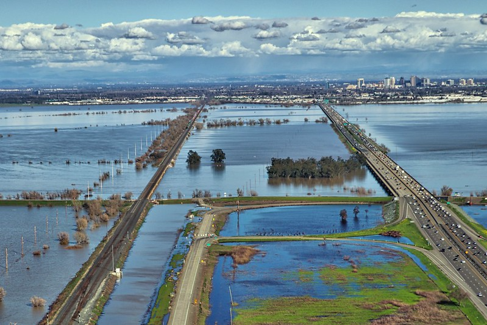

My research in this area examines the intersection of people and the natural environment to understand the relationship between people and ecological outcomes, as well as how water and environmental management approaches/decisions affect people over time. I have several ongoing projects related to this subject:

*Delta Residents Survey*: The Delta Residents Survey (DRS) aims to monitor social health of the estuary, including how people influence ecological outcomes of interest and understand how to support residents better to in turn improve management approaches/decisions that affect the estuary over time. 
The first DRS was mailed in 2023 to a random sample of 82,000 households across three Delta zones, yielding over 2,300 responses (2.9% response rate). The survey was designed to study multiple social scientific gaps identified in the 2022–2026 Delat Science Action Agenda and the 2019 Delta Plan 5-Year Review. The survey included 43 questions across five themes: sense of place, regional priorities and quality of life, environmental and climate change experiences, civic engagement and governance, and demographics. The study was conducted by a multi-university research team led by CA Sea Grant and funded by the Delta Stewardship Council’s (DSC) Delta Science Program, with extensive community engagement to inform survey design and interpretation. The second DRS is planned to be released in Spring 2027. The goals of this survey are to determine key social indicators to repeatedly measure, update and refine 2023 DRS questions to measure key indicators, and to use this process to develop a plan for long-term social monitoring. Check out the (DRS website for more information)[google.com/url?q=https://www.openicpsr.org/openicpsr/project/195447/version/V1/view&sa=D&source=docs&ust=1782339132847086&usg=AOvVaw2lyU9MGOcOUzJBwNXWmh6F].

## Related Outputs

See below for information about my previous research in this area.

::: {#publications}
:::
